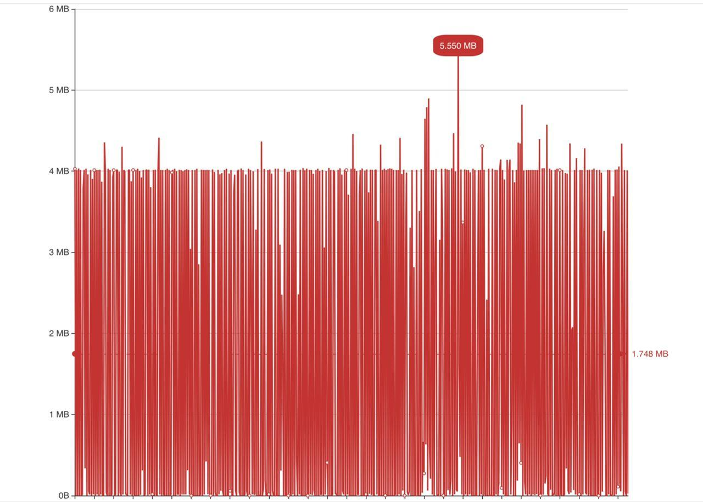

**声明：本项目仅以学习网络编程为目的，请在当地法律允许的范围内使用本程序。任何因错误用途导致的法律责任，与本项目无关！**

## 基于netty的http代理

1. 支持普通GET/POST和CONNECT隧道代理
2. 代理支持over TLS(也就是surge、小火箭等软件说的https proxy)
3. 防止主动嗅探是否为http代理
4. 使用openssl、epoll等技术，支持TLS v1.3。

## 配置解析

```shell script
ask4Authcate=true
```

这是防止主动嗅探的开关，true则会主动要求客户端发送用户密码，会存在被主动嗅探的风险。所以建议设置为false，除非是直接通过SwitchyOmega(chrome插件)使用

```shell script
# http代理配置
http.enable=true
http.port=80
http.reverseBit=false
http.auth=arloor:httpforarloor
```

http代理部分的配置，没啥好说的

```shell script
# over Tls配置
https.enable=true
https.port=443
https.auth=arloor:httpforarloor
https.fullchain.pem=1_xxx.com_bundle.crt
https.privkey.pem=2_xxx.com.key
```

https代理部分的配置，主要就是证书相关的几个配置需要说明

https.fullchain.pem 是域名证书+根证书的简单拼接（fullchain是指完整的证书寻找路径，域名证书是用根证书签发的，而签发根证书的证书系统中已自带，由这个完整路径，浏览器才能判断该证书是否有效）

https.privkey.pem 是私钥

以腾讯云上的免费ssl证书为例，nginx文件夹中的`1_xxx.com_bundle.crt`是fullchain，`2_xxx.com.key`是privkey，相信代码从业者能够从这里举一反三，从而知道从其他途径签发的证书应该如何配置。

## 客户端说明

1. 可以使用支持https的软件，例如：surge、shadowrocket、clash
2. chrome浏览器可以通过[SwitchyOmega](https://chrome.google.com/webstore/detail/proxy-switchyomega/padekgcemlokbadohgkifijomclgjgif)插件使用本代理（不推荐，会存在被嗅探的风险）
3. Java开发人员可以使用[connect](https://github.com/arloor/connect)项目

## 日志

```shell
2020-07-05 00:15:33.216 INFO  - xx.xx.xx.xx CONNECT www.google.com.hk:443  {www.google.com.hk}
2020-07-05 00:15:33.239 INFO  - xx.xx.xx.xx CONNECT www.google.com.hk:443  {www.google.com.hk}
2020-07-05 00:15:33.368 INFO  - xx.xx.xx.xx CONNECT www.google.com.hk:443  {www.google.com.hk}
2020-07-05 00:15:35.114 INFO  - xx.xx.xx.xx CONNECT www.gstatic.com:443  {www.gstatic.com}
2020-07-05 00:15:35.337 INFO  - xx.xx.xx.xx CONNECT adservice.google.com.hk:443  {adservice.google.com.hk}
2020-07-05 00:15:38.482 INFO  - xx.xx.xx.xx CONNECT github.githubassets.com:443  {github.githubassets.com}
2020-07-05 00:15:38.489 INFO  - xx.xx.xx.xx CONNECT github.com:443  {github.com}
2020-07-05 00:15:38.509 INFO  - xx.xx.xx.xx CONNECT github.com:443  {github.com}
2020-07-05 00:15:40.441 INFO  - xx.xx.xx.xx CONNECT avatars0.githubusercontent.com:443  {avatars0.githubusercontent.com}
2020-07-05 00:15:40.444 INFO  - xx.xx.xx.xx CONNECT avatars3.githubusercontent.com:443  {avatars3.githubusercontent.com}
2020-07-05 00:15:40.636 INFO  - xx.xx.xx.xx CONNECT content-autofill.googleapis.com:443  {content-autofill.googleapis.com}
2020-07-05 00:15:40.807 INFO  - xx.xx.xx.xx CONNECT www.google-analytics.com:443  {www.google-analytics.com}
2020-07-05 00:15:40.827 INFO  - xx.xx.xx.xx CONNECT github.com:443  {github.com}
2020-07-05 00:15:40.835 INFO  - xx.xx.xx.xx CONNECT github.com:443  {github.com}
2020-07-05 00:15:41.187 INFO  - xx.xx.xx.xx CONNECT alive.github.com:443  {alive.github.com}
2020-07-05 00:15:42.195 INFO  - xx.xx.xx.xx CONNECT api.github.com:443  {api.github.com}
2020-07-05 00:15:44.031 INFO  - xx.xx.xx.xx CONNECT avatars3.githubusercontent.com:443  {avatars3.githubusercontent.com}
2020-07-05 00:15:44.039 INFO  - xx.xx.xx.xx CONNECT avatars0.githubusercontent.com:443  {avatars0.githubusercontent.com}
2020-07-05 00:15:44.042 INFO  - xx.xx.xx.xx CONNECT avatars2.githubusercontent.com:443  {avatars2.githubusercontent.com}
```

## 网速监控

如果直接通过http(s)访问运行代理的端口，则可以看到上行网速，如下图所示



这是一台30Mbps的服务器，在观看youtbe 4k视频时的网速表现，可以看到表现很稳定。

## 电报讨论组

电报讨论组 https://t.me/popstary
