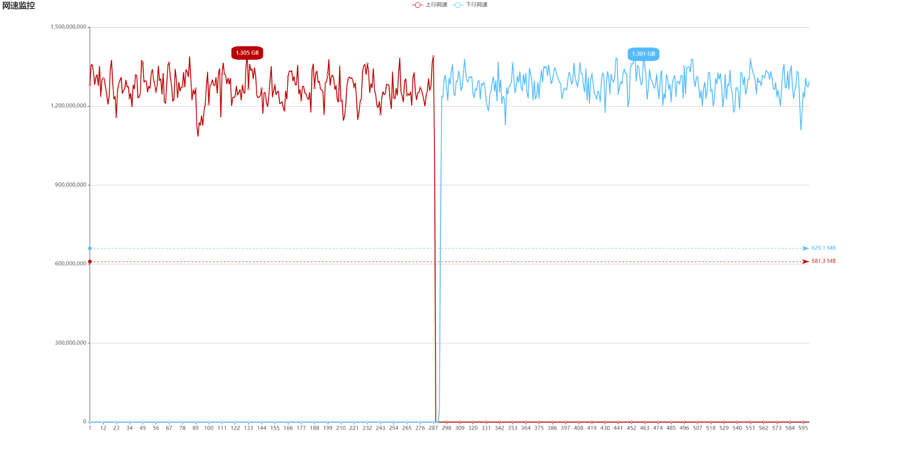

## 性能测试

环境：一台2核4G的服务器(华为云 Intel(R) Xeon(R) Gold 6278C CPU @ 2.60GHz)(好像是目前最强的服务器芯片)

代理客户端：[connect](https://github.com/arloor/connect)项目

软件：proxychains-ng iperf3

实验原理: iperf3是专业的测速软件。通过`proxychains`将iperf3测速的流量走`httpproxy`，从而测试httpproxy的性能。流量传输如下描述：

```shell
iperf3-client ---> connect ---> httpproxy ---> iperf3-server
```

在测速期间，以上四个进程使用2个cpu核心。

connect的jvm参数：

```shell script
# 分别为最小堆，最大堆，新生代大小，触发gc的元空间大小（一般是fullgc）两个survivor与eden区比值（=4，则2:4，默认为8即每个survivor为1/10的年轻代大小）
heap_option='-Xms2000m -Xmx2000m -Xmn600m -XX:MetaspaceSize=40M -XX:SurvivorRatio=8'
```

httpproxy的jvm参数：

```shell script
# 分别为最小堆，最大堆，新生代大小，触发gc的元空间大小（一般是fullgc）两个survivor与eden区比值（=6，则2:6，默认为8即每个survivor为1/10的年轻代大小）
heap_option='-Xms2000m -Xmx2000m -Xmn600m -XX:MetaspaceSize=40M -XX:SurvivorRatio=8'
```

从GC日志上看，没有看到fullGC，为减少youngGC，年轻代的大小刻意地设置地比较大，副作用用jvm占用的内存比较大（500MB，来自top的res字段），实际使用场景下，并不需要这么大的年轻代。

### 性能测试结果

HttpProxy上行速度(iperf3 295秒测试结果)：10.1 Gbits/sec ——**单线程单tcp连接跑满万兆网卡**

```shell script
[ ID] Interval           Transfer     Bandwidth
[  9]   0.00-295.72 sec  0.00 Bytes  0.00 bits/sec                  sender
[  9]   0.00-295.72 sec   349 GBytes  10.1 Gbits/sec                  receiver
iperf3: interrupt - the client has terminated
```

HttpProxy上行速度(iperf3 361秒测试结果)：10.3 Gbits/sec ——**单线程单tcp连接跑满万兆网卡**

```shell script
[ ID] Interval           Transfer     Bandwidth       Retr
[  9]   0.00-361.09 sec   431 GBytes  10.3 Gbits/sec   72             sender
[  9]   0.00-361.09 sec  0.00 Bytes  0.00 bits/sec                  receiver
iperf3: interrupt - the client has terminated
```

流量详情：来自`http(s)://host:port/net`




资源占用：

```shell script
top - 14:34:36 up 180 days, 21:39,  6 users,  load average: 3.82, 3.05, 2.56
Tasks: 130 total,   2 running, 128 sleeping,   0 stopped,   0 zombie
%Cpu(s): 47.2 us, 45.4 sy,  0.0 ni,  2.8 id,  0.0 wa,  0.5 hi,  4.0 si,  0.0 st
MiB Mem :   3940.4 total,    272.3 free,   2348.8 used,   1319.4 buff/cache
MiB Swap:   4069.0 total,   4029.8 free,     39.2 used.   1107.6 avail Mem

    PID USER      PR  NI    VIRT    RES    SHR S  %CPU  %MEM     TIME+ COMMAND
2175578 root      20   0 4619020 758548  19876 S  79.7  18.8  10:04.91 java
2175835 root      20   0 4579832 587452  20880 S  77.1  14.6   2:28.55 java
2167795 root      20   0   10264   2748   2496 R  15.0   0.1   3:59.31 iperf3
2175851 root      20   0   21076   2544   2348 S  13.6   0.1   0:24.98 iperf3
```